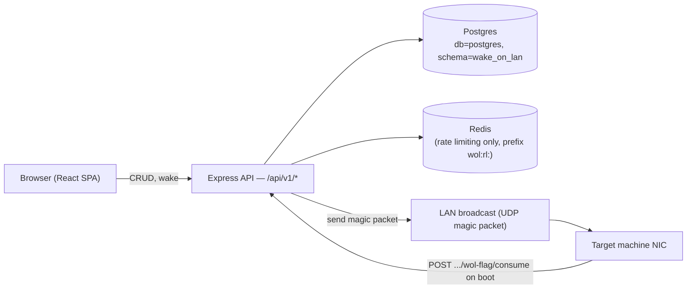

# CLAUDE.md

This file provides guidance to Claude Code (claude.ai/code) when working with code in this repository.

- [CLAUDE.md](#claudemd)
  - [Commands](#commands)
  - [Environment setup](#environment-setup)
  - [Architecture](#architecture)
    - [Request flow](#request-flow)
    - [Wake trigger and consume flow](#wake-trigger-and-consume-flow)
  - [Grafana dashboard](#grafana-dashboard)
  - [Testing](#testing)
    - [Test runner](#test-runner)
    - [Module mocking](#module-mocking)
    - [HTTP route tests](#http-route-tests)
    - [Frontend component tests](#frontend-component-tests)
    - [Logger silencing](#logger-silencing)
    - [Environment variables in tests](#environment-variables-in-tests)
  - [Accepted security findings](#accepted-security-findings)
  - [UI / Frontend conventions](#ui--frontend-conventions)
    - [UI verification workflow](#ui-verification-workflow)
    - [Mobile-responsive layout](#mobile-responsive-layout)
    - [Dark/light mode](#darklight-mode)
  - [Key conventions](#key-conventions)
    - [Request validation](#request-validation)
    - [Security conventions for new routes](#security-conventions-for-new-routes)
    - [Wake write-order invariant](#wake-write-order-invariant)
    - [TypeORM raw query result shapes](#typeorm-raw-query-result-shapes)
    - [CSP `upgradeInsecureRequests` and `crossOriginOpenerPolicy` are conditional on `sslEnabled`](#csp-upgradeinsecurerequests-and-crossoriginopenerpolicy-are-conditional-on-sslenabled)
    - [Accepted consume idempotency limitation](#accepted-consume-idempotency-limitation)

## Commands

```sh
# Start dependencies (local mode only — see "Environment setup")
bun run docker:up

# Development (run both concurrently)
bun run dev:server   # Express backend on :3001 with nodemon hot-reload
bun run dev:client   # Vite frontend on :5173, proxies /api/v1 → :3001

# Lint (prettier + eslint + stylelint + tsc)
bun run lint

# Full verification (lint + type-check + tests + dependency audit) — run before committing
bun run verify

# Tests
bun run test                              # vitest run (all tests, single pass)
bun run test:coverage                     # with coverage report
npx vitest path/to/file.test.ts           # run a single test file
npx vitest --watch                        # watch mode

# WOL spike — verify a real magic packet actually wakes a device from this
# exact runtime/network before relying on it (see scripts/spike-wol.ts header)
MAC=<mac> BROADCAST_ADDR=<broadcast> bun run spike-wol

# One-time: generate the local dev Postgres TLS cert (local mode only)
bun run generate-certs

# Production
bun run build          # bundles server → build/
bun run build-client   # tsc + vite build → public/
bun run start
```

## Environment setup

Copy one of the two templates to `.env` depending on where you're working from:

- `env/sample.env` — **local mode**: throwaway Postgres + Redis via `docker-compose.yml` (`bun run docker:up`). Works anywhere, no LAN access needed.
- `env/sample.remote.env` — **remote mode**: connects directly to the shared NAS Postgres/Redis instances (the same ones `tesla-powerwall-automation` uses in production). Only works on the home LAN. Isolation is via `DB_SCHEMA=wake_on_lan` and the `wol:rl:` Redis key prefix — confirmed empirically not to touch `tesla-powerwall-automation`'s schema or keys.

Either way, any TLS cert the chosen mode needs must live in **this project's own** `postgres/certs/` (gitignored) — never reference a cert path in another project's directory, to avoid coupling the two projects' filesystems together. Local mode's cert is generated with `bun run generate-certs` (see `scripts/generate-certs.sh`); remote mode's cert is copied in manually from wherever it was originally generated.

| Variable | Purpose |
| --- | --- |
| `DB_HOST` / `DB_PORT` / `DB_USERNAME` / `DB_PASSWORD` | PostgreSQL connection |
| `DB_NAME` | Always `postgres` — the shared instance's database name; this app isolates via `DB_SCHEMA`, not a separate database |
| `DB_SCHEMA` | Always `wake_on_lan` |
| `DB_SSL` / `DB_SSL_CA_PATH` | Postgres TLS — enforced in both dev modes, not just production |
| `REDIS_HOST` / `REDIS_PORT` / `REDIS_PASSWORD` | Redis connection, used only for rate-limit counters (no sessions in v1) |
| `ALLOWED_ORIGINS` | Comma-separated browser origins the API accepts cross-origin requests from |
| `SSL_ENABLED` / `SSL_KEY_PATH` / `SSL_CERT_PATH` | Optional HTTPS for the app itself (default off) — see [README.md](README.md#https--self-signed-certificate) |
| `WOL_DEFAULT_BROADCAST_ADDRESS` | Fallback broadcast address for targets with none configured |
| `WOL_SEND_METHOD` | `dgram` \| `wakeonlan` \| `auto` (default) — see [Architecture](#architecture) |

## Architecture



- **`src/server/`** — Express app, routes, TypeORM entities, WOL send logic
- **`src/client/`** — React 19 + Vite + MUI 7 frontend
- **`src/shared/`** — Zod schemas imported by both server (`validateBody` middleware) and client (form validation)
- **`src/server/bootstrap/logger-global.ts`** — loaded by `bunfig.toml` preload; injects `logger` (Pino) as a global — no import needed anywhere in server code

### Request flow

Express routes in `src/server/routes/` delegate to DB accessor functions in `src/server/util/routes/` (thin wrappers over TypeORM repositories) for CRUD, and to `src/server/util/wol/` for anything WOL-specific (sending packets, arming/consuming the wake flag). `src/server/util/wol/*` is deliberately isolated from Express/TypeORM so `scripts/spike-wol.ts` can import and reuse the exact same sending code the app uses.

### Wake trigger and consume flow

`POST /api/v1/targets/:id/wake` writes the DB flag (`armWakeFlag`) **before** sending the UDP packet — never the other order. If the DB write happened after the send, a crash between send and write could leave a real WOL boot with no fresh `triggered_at` row, causing the target's consume call to wrongly report `woken: false`. The reverse failure (flag written, send throws) is harmless — the target never powers on, so nothing calls consume against the orphaned row.

`POST /api/v1/targets/:id/wol-flag/consume` is a single atomic `UPDATE ... RETURNING` (see `util/wol/wakeFlags.ts`) — no transaction needed, Postgres's MVCC makes the check-and-consume atomic on its own.

## Grafana dashboard

`grafana-dashboards/wake-on-lan.json` is a Grafana Scenes dashboard (importable via Grafana → Dashboards → Import), sourced from Loki via the same structured Pino logs already shipped through the container's `--log-driver loki` pipeline (see `.github/workflows/deploy.yml`). See `grafana-dashboards/README.md` for the full panel-to-field mapping.

**Dashboard queries depend on exact `msg` strings and field names.** Renaming any of the following in application code will silently break the corresponding panel — update `grafana-dashboards/wake-on-lan.json` in the same PR.

| Field / value | Used by panel |
| --- | --- |
| `msg="Wake requested"` / `"Wake flag armed"` | Wakes Triggered Over Time |
| `msg="Magic packet sent"` / `"Magic packet send failed"`, `method` | Magic Packet Send Success/Failure |
| `msg="Wake flag consume checked"`, `result` | Consume Outcomes Over Time |
| `msg="Rate limit exceeded"` | Rate Limit Hits |
| `service="db"` | System Health / DB Errors |

## Testing

### Test runner

This project uses **Vitest** (not `bun test`). Configuration is in `vitest.config.ts`. The `verify` script runs `vitest run` automatically.

```sh
bun run test                    # single pass
bun run test:coverage           # with v8 coverage
npx vitest path/to/file.test.ts # single file
npx vitest --watch              # watch mode
```

Before implementing a new feature, endpoint, or non-trivial UI flow, identify what should be tested and add the tests alongside the implementation — do not treat tests as optional follow-up work. At minimum, consider: happy path, input validation failures, external dependency failures (DB/Redis down, magic packet send failure), and edge cases specific to the feature (freshness-window boundaries, an already-consumed flag, a double-wake race). The consume endpoint's freshness-boundary behavior is the single most important thing to test exhaustively — it's the core correctness guarantee of the whole app.

### Module mocking

Use `vi.mock()` for module-level mocks. Any mock state referenced inside a `vi.mock()` factory **must** be declared with `vi.hoisted()` — otherwise the factory runs before the variable is initialised (temporal dead zone error).

```typescript
const { mockQuery } = vi.hoisted(() => ({ mockQuery: vi.fn() }));

vi.mock("~/server/database/datasource", () => ({
  default: { getInstance: vi.fn(async () => ({ query: mockQuery })) },
  qualifiedTable: (table: string) => `"wake_on_lan".${table}`,
}));
```

Mock `node:dgram` and `Bun.spawn` the same way when testing `util/wol/sendMagicPacket.ts` — capture calls rather than touching a real socket/process.

### HTTP route tests

Use `supertest` to exercise an Express `Router` in isolation rather than importing the whole `main.ts` app (which has side effects: DB connection, rate-limiter Redis client, server listen). Mount just the router under test in a minimal `express()` app, and `vi.mock()` any DB/util modules it depends on.

### Frontend component tests

Component tests live in `tests/client/` (mirroring `tests/server/`) and use `@testing-library/react` + `jsdom`. Opt into jsdom per file via `/** @vitest-environment jsdom */` as the first line — the project's default Vitest environment is `node` (needed for server tests). Mock `TargetsContext`/`useNotification` rather than wrapping components in real providers.

### Logger silencing

`tests/setup.ts` globally silences the Pino logger in every test via `vi.spyOn` on all log levels, registered through `vitest.config.ts`'s `setupFiles`. To assert on a specific log call, import `logSpy` from the setup file:

```typescript
import { logSpy } from "../setup";

expect(logSpy("error")).toHaveBeenCalledWith(
  expect.objectContaining({ err: expect.anything() }),
  "Magic packet send failed",
);
```

### Environment variables in tests

Use `process.env` — not `Bun.env` — in any code that runs under both Bun (production) and Node.js (Vitest workers). `Bun.env` is Bun-specific and throws `ReferenceError: Bun is not defined` inside Vitest workers.

## Accepted security findings

Security issues that were consciously assessed and accepted rather than fixed, populated only as real `bun audit` findings get triaged — none yet. When one is added, mirror it here with the advisory id, affected package, a written reason, and the assessment date, matching `audit-allowlist.json`.

## UI / Frontend conventions

### UI verification workflow

Every UI change must be verified visually in a real browser before being considered done — reading the JSX or trusting the type-checker is not verification.

- **Use the Playwright MCP browser.** Take real screenshots at both viewports (below) rather than describing expected behavior.
- **Dev server endpoint**: `http://localhost:5173`.
- **Always check both viewports**:
  1. Desktop (≥ 1280 px)
  2. Mobile (375 px)
- **Check both light and dark mode** — use `page.emulateMedia({ colorScheme })` or the in-app toggle (see [Dark/light mode](#darklight-mode)), since a fix at one mode can silently regress the other.

### Mobile-responsive layout

All UI work must support both desktop (≥ 600 px, MUI `sm` and above) and mobile phones (< 600 px, MUI `xs`).

- **Breakpoint strategy** — use MUI `sm` (600 px) as the phone/desktop boundary. Use `sx` responsive objects (`sx={{ prop: { xs: v, sm: v } }}`) for simple cases; use `useMediaQuery(theme.breakpoints.down("sm"))` when JS branching is needed.
- **No hardcoded pixel widths** without a responsive fallback.
- **No overflow-prone horizontal flex rows** — always add `flexWrap: "wrap"` or switch to `flexDirection: { xs: "column", sm: "row" }`.
- **Complex dialogs** (the target form) use `fullScreen={isMobile}`.

### Dark/light mode

A manual in-app toggle lives in `NavMenu`'s `AppBar`, backed by `src/client/theme/{ThemeModeProvider.tsx, useThemeMode.ts, themeModeContextValue.ts}` — modeled on the `sproutly` project's theme provider pattern (Context + `useState`, translated from styled-components to MUI's `createTheme`/`ThemeProvider`). Resolution order on first load: an explicit `localStorage["theme"]` choice wins if present, otherwise `prefers-color-scheme: dark`, otherwise light. Once a user toggles, that choice persists across reloads and overrides the OS preference until they toggle again or clear storage.

## Key conventions

- **Path alias** — `~/` maps to `src/` (configured in `tsconfig.json` and `vite.config.ts`). Use it for all cross-module imports within `src/`.
- **TypeORM Entity Schema** — models use `EntitySchema` (not decorators). See `src/server/database/models/` for the pattern. Every entity includes `id` (uuid PK, auto-generated), `creation_time`, `modified_time` via `IBasicEntity` from `~/server/types/common`.
- **Dependency audit** — `bun run verify` ends with `bun run audit` (`scripts/audit.ts`, wrapping `bun audit`) and fails if vulnerabilities are found. Discuss the appropriate fix with the user before applying an override, auto-update, or allowlist entry — never do so silently.

### Request validation

Every new route that accepts a request body **must** validate it with Zod before touching the data:

1. Add or extend a schema in `src/shared/schemas/` — schemas live there so they can be imported from both Express routes and React forms.
2. Import `validateBody` from `~/server/middleware/validateBody` and add it to the middleware chain before the route handler.

```typescript
// src/shared/schemas/example.ts
import { z } from "zod";
export const ExampleSchema = z.object({ name: z.string().min(1) });

// src/server/routes/example.ts
import { validateBody } from "~/server/middleware/validateBody";
router.post("/example", validateBody(ExampleSchema), async (req, res) => { ... });
```

### Security conventions for new routes

- **Error propagation** — catch blocks must call `next(error)` rather than formatting a `res.status(500).json(...)` response directly. The centralized error handler in `main.ts` returns a generic message in production and the real message only in `NODE_ENV=development`.
- **No `error.message` in responses** — do not put internal exception detail into a JSON response body.
- **Rate limiting** — any new endpoint that triggers a side effect worth throttling should get its own limiter in `middleware/rateLimiter.ts`, using a distinct `wol:rl:<name>:` Redis key prefix.

### Wake write-order invariant

`POST /api/v1/targets/:id/wake` must always write the wake flag (`armWakeFlag`) **before** sending the magic packet, never after. See [Wake trigger and consume flow](#wake-trigger-and-consume-flow) above for why — inverting this order reintroduces the exact failure mode (a real WOL boot with no flag to check) this app exists to prevent. Do not "simplify" this ordering without re-reading that section first.

### TypeORM raw query result shapes

`dataSource.query()` returns **different shapes depending on statement type**: `SELECT`/`INSERT` return the rows array directly, but `UPDATE`/`DELETE` return a `[rows, rowCount]` tuple instead. A real bug shipped because `consumeWakeFlag()` checked `rows.length === 0` directly on that tuple (always `2`, never `0`), so the consume endpoint always reported `woken: true` regardless of whether a flag actually existed. Any new raw `dataSource.query()` call against `UPDATE`/`DELETE` must destructure as `const [rows] = await ds.query(...)`, not treat the result as a plain rows array. When mocking this in a test, mock the *exact* shape for the statement type being tested — see `tests/server/util/wol/wakeFlags.test.ts`.

### CSP `upgradeInsecureRequests` and `crossOriginOpenerPolicy` are conditional on `sslEnabled`

Helmet's `contentSecurityPolicy` includes the `upgrade-insecure-requests` directive **by default even when you pass your own custom `directives` object** — it merges with Helmet's defaults rather than replacing them. When `SSL_ENABLED` is off (this app is plain-HTTP-only unless explicitly configured otherwise), that directive tells the browser to upgrade every asset request to HTTPS, which then fails outright (`ERR_SSL_PROTOCOL_ERROR`) since there's no TLS listener — this broke the entire deployed app until caught by an actual browser-based check (`curl` alone won't catch it, since it doesn't enforce CSP). `main.ts` sets `upgradeInsecureRequests: null` and `crossOriginOpenerPolicy: false` specifically when `sslEnabled` is false, and lets both apply normally when `sslEnabled` is true. Don't remove this conditional without re-testing in an actual browser, not just via `curl`.

### Accepted consume idempotency limitation

If a genuine `{ woken: true }` response from `/wol-flag/consume` is lost in transit after the underlying `UPDATE` already committed, a retry sees `consumed_at IS NOT NULL` and gets a false `woken: false`. This is an accepted, documented limitation for v1 (see the README) — not something to "fix" with a client-supplied `attemptId`/replay mechanism without first discussing the tradeoff with the user, since that was a deliberate scope decision, not an oversight.
